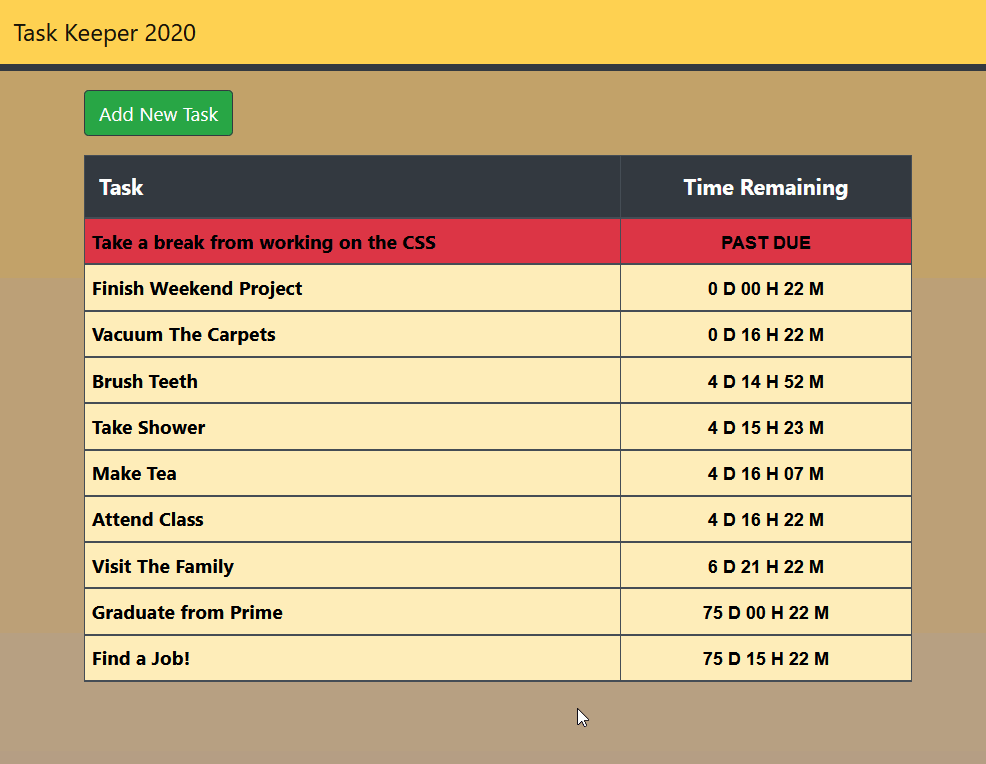

# SQL TODO LIST

## Description

_Duration: 3 Days_

This application functions as a task manager & timer for multiple tasks. Tasks can be added to a list, marked as complete, and deleted. Each task can be created with a deadline and a timer will be displayed to show how much time is left before the deadline. Unfinished tasks are colored yellow, finished ones are green, and overdue ones are red. Clicking/tapping on an item in the task list will expand the item to show additional details. Each task and its corresponding status is saved and retrieved from a database.

## Example GIF

## Setup

1. Run the query from the database.sql file to create a new table in the SQL database of your choice, values are included if you want some example tasks.
2. Use the "$ npm install" command to install dependencies.
3. Use the '$ npm start" command to start the server. 
4. Access the webpage via the url "localhost:5000:

## Usage

1. To add a new task click the "Add New Task" button, the input panel will expand. Fill in the fields and press "Create Task" to add the task to the task list. The input field can be collapsed by pressing the "Add New Task" button again.
2. Each task can be expanded by clicking/tapping to view included details, as well the complete button, the delete button, and the timestamps for the deadline and creation date. A second click/tap will collapse the task again.
3. To mark a task as complete, expand the task and press the complete button (The green button with a check mark). The complete button works as a toggle so if it was pressed by accident or if the task is not actually complete, it can be pressed again to undo the completion.
4. To delete a task, expand the task and press the delete button (The red button with an "X"). This will remove the task from the list as well as the database.

## Built With

JavaScript, jQuery, Node.js, Bootstrap, Express, PostgreSQL

## Acknowledgement
Thanks to [Prime Digital Academy](www.primeacademy.io) who equipped and helped me to make this application a reality.